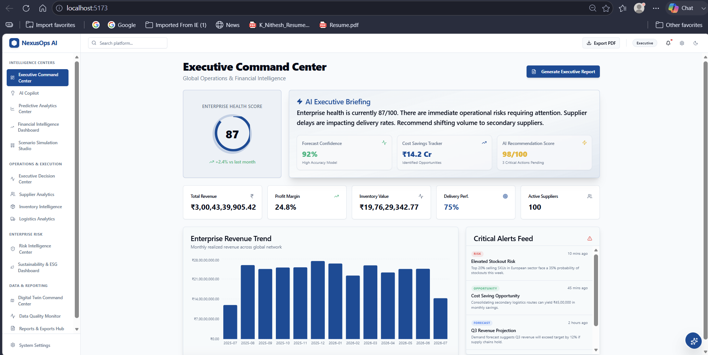
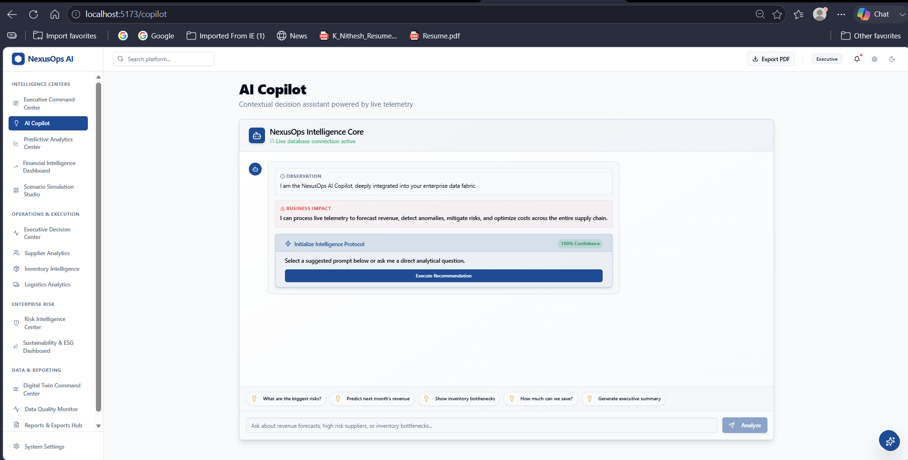

# NexusOps AI

Enterprise Decision Intelligence Platform with AI Copilot, Predictive Analytics, Risk Intelligence, ESG Monitoring and Executive Reporting.

## Key Features

- Executive Command Center
- AI Copilot
- Predictive Analytics
- Financial Intelligence Dashboard
- Scenario Simulation Studio
- Executive Decision Center
- Supplier Analytics
- Inventory Intelligence
- Logistics Analytics
- Risk Intelligence Center
- Sustainability & ESG Dashboard
- Digital Twin Command Center
- Data Quality Monitor
- Reports & Exports Hub

## Technology Stack

- React
- TypeScript
- Vite
- FastAPI
- Python
- Tailwind CSS
- Recharts

# Screenshots

## Executive Dashboard

## AI Copilot

## Predictive Analytics

## Supplier Analytics

## Logistics Analytics

## Risk Intelligence

## Digital Twin Command Center

## Business Value

NexusOps AI is a modern enterprise operations intelligence platform that combines predictive analytics, AI-powered decision support, digital twin visualization, risk intelligence, and executive reporting into a unified operational command center.

## Author

Chandana Kallishetty
